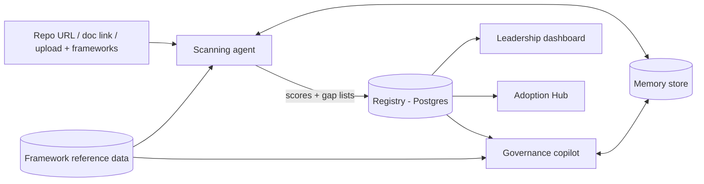

# LEAI — Enterprise AI Governance Platform

Product Specification
Version: 1.0 (merged — supersedes `leah-prd.md` and `FunctionalReqs.md`)
Date: 2026-07-21

## 1. Problem Statement

Enterprises want to adopt AI at scale, but the people accountable for that adoption cannot confidently answer the question that gates every deployment: "Is this AI system compliant for the frameworks and jurisdictions we operate in?"

Today that answer is assembled manually: someone inventories what AI a system actually uses, reads the applicable frameworks, maps obligations to evidence, and re-explains the same organizational context — architecture, prior exceptions, prior decisions — every time a review happens. The work is slow, unrepeatable, invisible to leadership, and gets redone from scratch on every scan. The result is stalled adoption and a governance function nobody outside compliance ever reads.

LEAI (Large Enterprise AI) is a single-enterprise governance platform that:

- automates AI-usage inventory from a repo, document, or file,
- scores that inventory against selected compliance frameworks, clause by clause,
- remembers what it learned about the organization so each subsequent scan is faster and sharper than the last,
- tracks every AI system through a governance lifecycle to approval,
- and answers governance questions through a conversational copilot grounded in that same memory and registry.

## 2. Delivery Model

**Single-enterprise deployment.** Each customer runs their own instance (self-hosted or private cloud). One tenant per deployment. All data — scans, registry, memory — belongs to that enterprise and stays inside its boundary. There is no cross-customer data flow, no `tenant_id` plumbing, and no cross-tenant isolation testing burden. (Multi-tenant SaaS delivery is a possible future direction — see Cut List — but is not a v1 concern anywhere in this spec.)

## 3. Users

| User | Primary surface | Needs |
|------|----------------|-------|
| CTO / executive sponsor | Leadership dashboard | Overall governance posture, risk distribution, adoption pipeline, ROI narrative |
| Governance / compliance lead | Scanner, Adoption Hub | Run scans, work gap lists, manage lifecycle and regulator-doc status. The primary daily user. |
| Engineering / delivery teams | Scanner, Adoption Hub | Submit artifacts for scanning, see their systems' gaps and remediation guidance |
| Auditor (internal or external) | Adoption Hub audit log, Scan History | Review what was found, what was accepted as an exception, and why, over time |
| All of the above | Governance copilot | Ask questions in natural language, get answers grounded in registry and memory |

## 4. Core Concept: Why Institutional Memory

A stateless scan-and-forget tool re-derives the same facts every time: the same architecture questions, the same accepted risk justifications, the same false positives. LEAI's agent instead **decides what to remember, what to forget, and what to update** as it learns about the organization.

- **Scan 1** on a system: the agent builds a system profile, scores it, and writes durable facts to memory — e.g. *"this org self-hosts all models, so data-transfer clauses are consistently N/A"* or *"this system's risk tier was justified as Limited Risk because a human reviews every decision before it's actioned."*
- **Scan 2** (a rescan, an updated artifact, or a related system): the agent recalls what it learned and applies it — it does not ask the org to re-justify what's already established, and it explicitly flags when new evidence **contradicts** memory (e.g. the human-review step was removed from the code — a regression, not a fresh gap).
- Over many scans, the governance picture becomes cumulative: an audit trail of what was found, what was fixed, what was accepted as an exception, and why.
- The same memory grounds the **governance copilot**, so a question asked before and after a material change produces a measurably better, more current answer.

This compounding behavior — not the score itself — is the product's core differentiator, and it is tested as a first-class behavior (Section 11).

## 5. Scope

v1 ships the five subsystems below. Each subsystem's acceptance criteria are the definition of done. Anything not listed here or explicitly required by it is in the Cut List (Section 12).

### 5.1 Compliance Hub (framework library)

**Purpose:** let the user discover which governance frameworks apply to their organization, by geography and sector.

- User selects a **geography** (EU, UK, US, India, China, ...) and, optionally, a **sector overlay** (Financial Services, Healthcare, ...).
- The Hub returns the relevant frameworks — e.g. EU AI Act, UK AI Safety Framework, NIST AI RMF, ISO/IEC 42001, sector overlays such as SR 11-7 or FDA AI/ML SaMD guidance.
- v1 ships with full clause content for exactly three frameworks — **EU AI Act, NIST AI RMF, ISO/IEC 42001** — since these are the ones the scoring engine and eval suite are built and tested against. Additional frameworks in the geography/sector library may be listed for discovery but marked **"clause content not yet available"** until authored; this is an honest content gap, not a hidden one.
- Each framework entry shows: name, version, issuing body, geography/sector tags, last-updated date, clause count, source link.
- The user checks/unchecks which frameworks to apply to a scan. This selection drives scoring (5.3).
- Frameworks are versioned. If a framework has been updated since the organization last scanned against it, the Hub shows a visible flag: *"Updated since your last scan — N clauses changed"* and flags affected historical scans for rescan.
- Framework content is structured reference data (Section 8.3), refreshed by publishing new versions into that data — not a live, always-on regulation monitor (explicitly out of scope, Section 12).
- The user may save a named framework subset (e.g. "EU Baseline") for reuse across scans.

**Acceptance criteria:**
- Selecting a geography returns a framework list with the fields above, sourced from the reference data store.
- The three fully-authored frameworks display full clause lists; other listed frameworks are visibly marked as not yet scorable.
- A framework version bump visibly flags every affected historical scan for rescan.

### 5.2 Scanner and Scoring Engine

**Input:** one artifact — a Git repository URL, a document link, or an uploaded file (PDF/Word/text) — plus one or more selected frameworks. **Output:** a system profile, a clause-level score per framework, a category rollup, an overall Compliance Score, and a gap list.

The agent is a single Claude-powered agent per deployment, with a persistent Memory tool, that both reads the artifact and judges each clause directly (no separate deterministic rule engine in v1 — see Section 9 for why).

**Scan flow:**

1. **Parse.** The agent reads the artifact and builds a **System Profile**: what kind of AI system this is, what data it processes, what decisions it influences, who is affected, and an initial risk-tier estimate.
2. **Recall.** The agent queries memory for this system (and its organization) before scoring: established exceptions, prior accepted risk justifications, prior gaps and their remediation status.
3. **Score.** For each clause in each selected framework, the agent assigns a finding:

   | Finding | Meaning |
   |---|---|
   | Pass | Clause requirement is met |
   | Partial | Some evidence of compliance, but incomplete |
   | Gap | No evidence the requirement is met |
   | Not Applicable | Clause does not apply, per the System Profile or established memory |

   Every finding carries a rationale and, where the artifact supports it, a citation to the specific evidence (file, section, or excerpt) behind it.
4. **Reconcile against memory.** If a clause was previously Pass/N/A based on an established exception and the new artifact still supports that, the agent carries it forward directly — but always states that it did so and why; nothing is a silent carry-over. If new evidence **contradicts** memory (e.g. a control that existed is now missing), the agent flags this explicitly as a **regression**, distinct from a fresh gap.
5. **Roll up.** Clause scores aggregate into categories, and categories into an overall Compliance Score (formula and bands in 5.2.1). Categories are derived dynamically from whichever frameworks were selected — not hard-coded — since each framework has its own taxonomy.
6. **Update memory.** The agent writes back: new exceptions, new findings, remediation status changes, and anything durable enough to matter next time. See Section 6 for what is and isn't written.
7. **Update the registry.** A completed scan creates or updates the system's Adoption Hub record (Section 5.3) and pushes a new data point to the Leadership Dashboard (Section 5.4).

**Category aggregation and scoring:**

```
Clause Score        =  Pass = 100, Partial = 50, Gap = 0   (N/A clauses excluded from the average)
Category Score      =  average of clause scores within that category
Compliance Score    =  weighted average of category scores
                        (weights default to each framework's own stated risk tiers;
                         if multiple frameworks are selected, default relative
                         framework weighting is equal, user-adjustable)
```

| Band | Range | Label |
|---|---|---|
| Red | 0–40 | High Risk |
| Amber | 41–70 | Moderate |
| Green | 71–100 | Confident |

**Rescans:** triggered by artifact change (new commit SHA / new document version) or framework version change — never by asking the copilot a question. A rescan produces a **delta view** distinguishing: *newly resolved* (was Gap, now Pass), *regression* (was Pass, now Gap — contradicts memory), and *newly introduced* (a clause newly applicable, e.g. from a framework update).

**Acceptance criteria:**
- Scanning a seeded test repository and a seeded test document each yield the expected system profile and clause findings, checked against a human-graded answer key (see Section 11 — this is judged scoring, not byte-reproducible).
- Unreachable/unauthorized artifacts fail the scan with a visible reason; no score is recorded.
- If parsing completes only partially (e.g. a file subset unreadable), the scan is marked `incomplete` and lists what wasn't covered; incomplete scans are visually distinct everywhere they appear.
- Running a second scan on the same system visibly reflects memory: either a stated carry-forward of an established exception, or a stated regression flag — never a silent identical re-derivation with no reference to prior findings.
- A rescan after a framework version bump correctly limits new findings to the changed clauses' territory and preserves prior findings elsewhere.

### 5.3 Adoption Hub

The AI system registry and lifecycle tracker — one record per system across its life, not just its latest scan.

- Every scanned system has a registry record: name, owner, use case description, geography, artifact reference (repo/doc/upload), latest score per framework, lifecycle status.
- **Lifecycle states:** `proposed → scanned → documented → submitted → approved → live`. Transitions are manual (a human moves a system forward) except `proposed → scanned`, which the first completed scan performs automatically.
- **Regulator-documentation tracking:** per system, a checklist of required documents (defined per framework in its reference data) with status (missing, drafted, submitted, accepted) and a free-text evidence reference. LEAI tracks status; it does not generate or store the documents themselves.
- **Audit log:** every lifecycle transition, attestation change, and doc-status change is recorded with who, what, when.

**Acceptance criteria:**
- A governance lead can take a system from `proposed` to `live`, with every transition recorded in the audit log.
- The registry answers "what AI systems do we have, at what lifecycle stage, with what posture" in one view.
- Regulator-document status is visible per system and per framework, independent of the compliance score.

### 5.4 Leadership Dashboard

Read-only views over the registry and scan history, for the executive audience. Deliberately free of clause-level detail — this is a boardroom view, not a working tool.

| Metric | Definition |
|---|---|
| **Governance Confidence Score** | Weighted average of Compliance Scores across every scanned system, banded Red/Amber/Green |
| **Risk Exposure Breakdown** | Systems by risk band, with trend over time |
| **Adoption Pipeline** | Systems by lifecycle stage |
| **Remediation Velocity** | Average time from a Gap being found to it being resolved, tracked over successive scans |
| **Governed Coverage** | Of all AI systems logged as in use, what percentage have been scanned at all — surfaces "shadow AI" |
| **ROI Narrative** | An editable log pairing each logged AI initiative with a stated business outcome (hours saved, cost avoided) alongside its governance score — value and risk shown side by side |

- Every aggregate drills down to the underlying systems and their score records.
- The dashboard renders entirely from registry and score data; it performs no scans and no LLM calls at render time.

**Acceptance criteria:**
- A CTO can answer "what is our current exposure and what is in the pipeline" from the landing view without training.
- Governed Coverage correctly reflects systems logged but not yet scanned.

### 5.5 Governance Copilot

A conversational agent, built on Claude with the same Memory tool and memory store as the Scanner, that answers governance questions grounded in the registry, framework reference data, and memory.

- Example questions: *"Can we ship system X in the EU?"*, *"What is blocking system Y from approval?"*, *"Which of our systems would be high-risk under the EU AI Act?"*
- Answers cite registry records and framework clauses. The copilot never invents a score; it reports what the Scanner recorded, and says so explicitly when no record exists.
- Memory is scoped per system via metadata keys, within the single-enterprise memory store. Facts learned about one system do not surface in answers about another.
- Explicit memory policy in the system prompt: always remember distilled system facts, determinations, and stated organizational preferences; never remember credentials, personal data, or raw document content.
- **Contradiction handling:** identical to the Scanner's reconciliation behavior (5.2 step 4) — when new data or a user statement contradicts stored memory, the copilot states the conflict and asks which to trust. It never silently overwrites.
- Asking the copilot a question never triggers a scan or a rescan.

**Acceptance criteria:**
- Copilot answers include citations resolvable to registry records or framework clauses.
- Cross-system memory isolation is verified by test: facts seeded for system A do not surface in answers about system B.
- The contradiction test (a deliberately conflicting follow-up) produces flag-and-ask behavior, not a silent overwrite.
- The same governance question, asked before and after a material registry change, produces a measurably better, correctly-cited answer the second time (the "sharpness" test — see Section 11).

## 6. The Memory Agent — What Gets Remembered

**Remembered (durable, organization- or system-level facts):**
- Architecture facts that make certain clauses consistently N/A (e.g. "self-hosted models only — no third-party data transfer")
- Accepted risk-tier justifications and who approved them
- Remediation actions taken in response to a prior Gap, and whether verified as resolved
- Recurring false positives specific to this organization's tooling or terminology

**Not remembered:**
- Point-in-time facts specific to a single artifact version (a specific commit SHA, a specific document draft) — these belong to that scan's own record, not durable memory
- Anything not explicitly confirmed by artifact evidence or explicit user confirmation
- Credentials, personal data, or raw document content

**Reconciliation rule (applies identically in Scanner and Copilot):** when new evidence conflicts with memory, (1) state the conflict explicitly, never silently overwrite; (2) prefer the newer evidence for the current answer/score; (3) flag whether memory itself should be updated, downgraded, or retained as a documented exception — as a note in the output, not a blocking prompt.

## 7. Architecture



Component boundaries:

- **Scanning agent**: Claude-powered; owns artifact fetching/parsing, system-profile construction, clause-level judgment, and memory read/write. The only component that reads raw artifact content.
- **Copilot agent**: Claude-powered; reads registry and framework reference data through the same query layer as the web app, and shares the memory store with the Scanner (scoped per system).
- **Registry**: Postgres. System records, scan records (append-only), lifecycle transitions, regulator-doc status, audit log.
- **Framework reference data**: structured, versioned content (Section 8.3) — geography/sector tags, clause lists, weights, source links.
- **Web application**: Compliance Hub, Scan wizard, Scan History, Adoption Hub, Leadership Dashboard, copilot chat UI — all thin over the registry and reference data.

**Technology commitments:** Claude API (current Claude 5 family) for both agents; Claude Memory tool for persistent per-system memory; Postgres for the registry; structured (e.g. YAML/JSON) versioned framework reference data. Web framework is an implementation-plan decision, not a spec commitment.

## 8. Data Model (core entities)

- **System**: id, name, owner, use case, geography, artifact reference, lifecycle status.
- **Scan**: id, system id, artifact reference (commit SHA / doc version), framework versions applied, system profile, clause findings [], category scores [], overall score, status (complete/incomplete + coverage notes), timestamps.
- **Framework** (shared reference data, not a tenant concept here — just platform content): id, name, version, issuing body, geography/sector tags, clauses [] (id, text summary, category, risk weight), source link, last-updated date.
- **RegulatorDocument**: system id, framework, document type, status, evidence reference.
- **LifecycleEvent / AuditEntry**: system id, actor, transition or change, timestamp.
- **MemoryRecord** (conceptual — actual storage via Claude Memory tool): system id (scope key), fact, category (exception / risk justification / remediation / false-positive), established-by scan id, timestamp.

## 9. Why LLM-Judged Scoring (not a deterministic rule engine)

v1 deliberately scores clauses via direct agent judgment rather than a separate deterministic rule engine over typed detections:

- It lets the same agent and memory model work across **arbitrary artifact types** (repo, document, upload) and an open-ended framework library, without first building a structured-detection schema for every possible framework's obligations.
- It is dramatically cheaper to build and extend: adding a new framework means authoring clause reference data, not writing new detection-to-obligation mapping logic.
- The tradeoff, stated honestly: scores are not guaranteed byte-reproducible run-to-run. This is mitigated by (a) every finding carrying a stated rationale and citation, (b) the eval suite (Section 11) grading against a human answer key rather than exact-match, and (c) every scan record storing its full inputs (artifact reference, framework versions, full agent output) for audit and re-review.
- A deterministic rule engine remains a plausible v2 direction once framework coverage and obligation taxonomies stabilize — it is not ruled out, just not a v1 requirement.

## 10. Correctness and Evals

- **Schemas at the boundaries**: system profiles, clause findings, scan records, and copilot citations all validate against published schemas.
- **Scan eval suite**: a set of seeded artifacts (repos and documents) with a human-graded answer key for expected findings. The suite runs in CI; a grading regression fails the build. This is the product's honesty check given judged (not deterministic) scoring.
- **Memory-sharpness eval**: the same question or scan re-run before and after a seeded material change, graded for whether the second answer correctly reflects the change (carry-forward or regression, as appropriate).
- **Copilot evals**: memory-isolation test (facts seeded for system A never surface for system B) and contradiction flag-and-ask test, automated against a seeded instance.
- **Error handling principle**: nothing silent. Failed scans are visible failures. Partial coverage is labeled. Missing data in copilot answers is stated as missing, not glossed over.

## 11. Design Principles

- **No silent carry-over.** Any time memory influences a finding, the output says so explicitly — auditability matters more than a clean-looking report.
- **Regression is not a fresh gap.** A control that was present and is now missing is flagged distinctly, because it signals a process failure, not merely an unaddressed requirement.
- **Categories are derived, not hard-coded.** The scoring taxonomy reflects exactly the frameworks selected for a given scan.
- **Leadership sees outcomes, not mechanics.** The dashboard is free of clause-level detail by design.
- **Scope honesty.** Frameworks listed but not yet authored are marked as such, not silently omitted or silently scored anyway. Scoring is judged, not deterministic, and the spec says so rather than implying more.

## 12. Cut List

Out of scope for v1. Cut, not deferred — none of these carries an implied commitment.

- Multi-tenant SaaS delivery and cross-tenant isolation
- A separate deterministic rule engine (see Section 9 for the reasoning)
- Always-on regulation monitoring / scheduled background framework watchers
- Specialist swarm / multi-agent per-framework scoring
- Live AI-system-inventory integrations (cloud/model registries, internal catalogs) — v1 uses scan-derived records plus a manually logged AI system list for coverage/ROI purposes
- Automated ROI telemetry (usage/cost feeds) — v1 ROI narrative entries are manually logged
- Generation or storage of regulator submission documents (status tracking only)
- Non-Git, non-URL, non-uploadable code or document sources
- Fine-grained RBAC (v1 has two roles: read-only viewer and governance editor)

## 13. Success Criteria

v1 is successful when, on a real enterprise deployment:

1. A user can select a geography and see a correct, current list of applicable frameworks, with clause content available for EU AI Act, NIST AI RMF, and ISO/IEC 42001.
2. A governance lead can run a scan from a repo URL, doc link, or upload, and receive a clause-level, category-rolled-up Compliance Score with citations, which a framework-literate reviewer accepts as reasonable.
3. Running a second scan on the same system visibly reflects what was learned in the first — either by correctly carrying forward an established exception, or by correctly flagging a regression.
4. A governance lead can take a system from `proposed` to `live` through the Adoption Hub, with every transition and doc-status change in the audit log.
5. The CTO answers "what is our AI exposure and adoption pipeline status" from the dashboard alone, with no training.
6. The copilot demonstrably improves: the same governance question, asked before and after a registry change, is visibly sharper and correctly cited the second time — live, in front of a reviewer.
7. Every scan record's full inputs and outputs are retrievable, so a reviewer can independently assess how a score was reached.

---

*This document supersedes `docs/leah-prd.md` and `FunctionalReqs.md`, which are retained for historical reference.*
