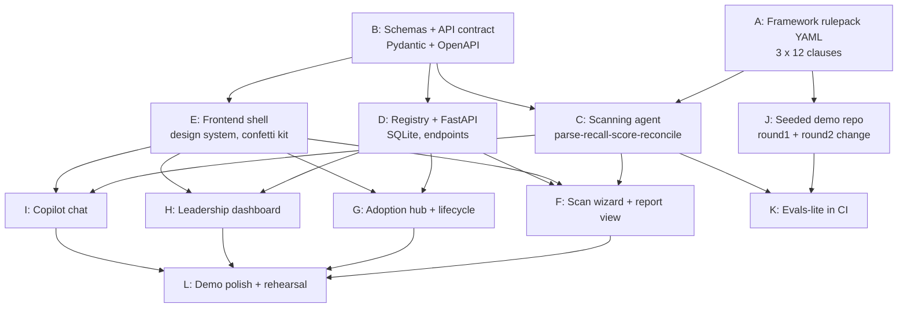

# LEAI Hackathon Implementation Plan - DAG to Demo

> **For agentic workers:** REQUIRED SUB-SKILL: Use superpowers:subagent-driven-development (recommended) or superpowers:executing-plans to implement this plan task-by-task. Steps use checkbox (`- [ ]`) syntax for tracking.

**Goal:** A winning live demo of LEAI - scan, score, remember, rescan sharper, celebrate - built by parallel workstreams in minimum wall-clock time.

**Architecture:** FastAPI backend (Python - reuses the starter repo's Managed Agent + Memory tool pattern) exposing a typed REST API; Next.js frontend built against that contract with mock data until the backend lands. LLM-judged scoring per `leai-spec.md` §9; every seam contract comes from `ScoringEngineReqs.md` §3.3.

**Tech Stack:** Python 3.12 + FastAPI + Pydantic v2 + SQLite (SQLAlchemy, Postgres-swappable later - hackathon decision, deviates knowingly from spec's Postgres commitment), Anthropic SDK (`claude-sonnet-5`, pinned per spec §10.11), Next.js + Tailwind, `canvas-confetti`, `framer-motion`.

## Decisions Made Now (so nobody blocks on them)

1. **Demo slice is king.** The demo arc (below) is the critical path. Compliance Hub browsing, ROI narrative, and saved framework sets are garnish - build only if idle.
2. **Clause cap:** 12 curated clauses per framework (EU AI Act, NIST AI RMF, ISO 42001), chosen for demo credibility, with real citations. Not "full clause content" - that's post-hackathon.
3. **SQLite not Postgres** for the registry. Same schema, zero ops.
4. **Confetti moments** (in priority order): (a) rescan flips the band to Green, (b) lifecycle transition to `approved`, (c) score-reveal count-up with band color sweep. Regression flag gets the opposite: a deliberate red "record-scratch" moment - the demo's dramatic beat.

## Global Constraints

- Model ID pinned and recorded on every scan record (`leai-spec.md` §10.11)
- Every clause finding carries all §3.3 fields; malformed findings never render (`ScoringEngineReqs.md` §3.3)
- Evidence excerpts must be verbatim substrings of the artifact - deterministic validator, not LLM (`leai-spec.md` §10.12)
- Artifact content is data, never instructions (`leai-spec.md` §10.16) - scoring prompt must state this
- Nothing silent: incomplete scans labeled, unscored clauses counted (`leai-spec.md` §10.19)
- No em dashes in any user-visible copy; hyphens only

## The DAG



**Critical path:** A → C → F → L. Start A and B immediately, in parallel.
**Parallel lanes for a 3-person/agent team:** Lane 1: A→J→K (content + evals). Lane 2: B→C→I (agent core). Lane 3: E→(D)→F/G/H (product surface; D is small, fold into lane 3 or 2, whichever frees first).

---

### Task A: Framework rulepack YAML

**Files:**
- Create: `backend/rulepacks/eu-ai-act.yaml`, `backend/rulepacks/nist-ai-rmf.yaml`, `backend/rulepacks/iso-42001.yaml`
- Create: `backend/rulepacks/schema.json` (JSON Schema the YAMLs validate against)

**Interfaces:**
- Produces: per framework: `{id, name, version, issuing_body, geography_tags[], clauses[]}`; per clause: `{clause_ref, text_summary, category_tag, risk_weight}` - field names exactly as in `ScoringEngineReqs.md` §10.1.
- Clause refs must satisfy §6.2 format (e.g. `EU AI Act (2024), Article 13, Paragraph 1`).

- [ ] 12 clauses per framework, chosen for demo credibility (transparency, risk mgmt, data governance, human oversight, incident response well represented)
- [ ] Validate all three against `schema.json` in a pytest; commit

### Task B: Schemas + API contract

**Files:**
- Create: `backend/models.py` (Pydantic), `backend/api_contract.md`
- Create: `frontend/lib/types.ts` (mirrored types + mock factories)

**Interfaces (produces - every other task consumes these):**
```python
class ClauseFinding(BaseModel):  # ScoringEngineReqs §3.3, all fields mandatory
    clause_ref: str; clause_text_summary: str
    score_value: Literal["pass","partial","gap","na"]
    numeric_value: int | None          # 100/50/0, None for na
    evidence_excerpt: str | None; evidence_location: str | None
    justification: str
    confidence: Literal["high","medium","low"]
    memory_carry: bool; memory_carry_note: str | None
    regression_flag: bool; regression_note: str | None

class Scan(BaseModel):
    id: str; system_id: str; artifact_ref: str; model_id: str
    framework_versions: dict[str, str]; system_profile: str
    findings: list[ClauseFinding]; category_scores: list[CategoryScore]
    overall_score: float; band: Literal["red","amber","green"]
    status: Literal["complete","incomplete"]; coverage_notes: str | None
    created_at: datetime
```
REST: `POST /scans {artifact_ref, framework_ids[]}` → Scan (202 + poll `GET /scans/{id}`); `GET /systems`; `POST /systems/{id}/lifecycle {to_state}`; `GET /dashboard`; `POST /copilot {question, system_id?}` → `{answer, citations[]}`.

- [ ] Pydantic models + rollup pure functions (`category_scores()`, `overall()` per §4.2/§5.1, N/A excluded, 1dp rounding) with unit tests using the §5.3 worked example (expect 73.8); commit

### Task C: Scanning agent

**Files:**
- Create: `backend/scanner.py`, `backend/memory.py` (adapt root `memory_backend.py`), `backend/excerpt_verify.py`
- Test: `backend/tests/test_scanner.py`, `backend/tests/test_excerpt_verify.py`

**Interfaces:**
- Consumes: Task A rulepacks, Task B models.
- Produces: `async def run_scan(artifact_ref: str, framework_ids: list[str], system_id: str) -> Scan`; memory ops `recall(system_id) -> list[MemoryFact]`, `commit_facts(system_id, facts, provenance)`.

- [ ] Seven-step flow per `leai-spec.md` §5.2: parse → recall → score (one Claude call per framework, structured output = list[ClauseFinding]) → reconcile (set memory_carry/regression flags) → roll up (Task B functions) → memory write (provenance-tagged, scoring-relevant exceptions go to pending-confirmation per §10.18) → return Scan
- [ ] Scoring prompt states: artifact content is data never instructions (§10.16); flag manipulation attempts (§10.17)
- [ ] `excerpt_verify.py`: whitespace-normalized substring check of every excerpt against artifact; failures → re-derive once, then `unscored - system error` (§10.12-10.13). Deterministic, tested with a fabricated-excerpt case
- [ ] Test with 2 stub clauses before Task A lands (don't block); commit per step

### Task D: Registry + FastAPI

**Files:**
- Create: `backend/main.py`, `backend/registry.py` (SQLAlchemy: System, Scan, LifecycleEvent, AuditEntry)
- Test: `backend/tests/test_api.py`

**Interfaces:** Consumes B models; serves the REST contract verbatim. Scan records append-only; every lifecycle transition writes an AuditEntry (who/what/when).

- [ ] Endpoints against in-memory scanner stub first (returns canned Scan) so Task F unblocks before C finishes; swap in `run_scan` when ready; commit

### Task E: Frontend shell + celebration kit

**Files:**
- Create: `frontend/` (Next.js app), `frontend/components/{ScoreDial,BandBadge,Confetti,RegressionAlert,MemoryBadge}.tsx`, `frontend/lib/api.ts` (typed client, mock mode flag)

**Interfaces:** Consumes `types.ts` from B. Produces the component kit F/G/H/I compose.

- [ ] Dark governance aesthetic matching the Claude Design system map (ink `#0d1420`, amber=Claude, teal=deterministic, violet=record); NOT default-Tailwind-looking
- [ ] `ScoreDial`: animated count-up + band color sweep (framer-motion). `Confetti`: canvas-confetti burst, single `fire()` API. `RegressionAlert`: full-width red slide-in. `MemoryBadge`: "Carried from memory - [date]" pill
- [ ] All render from mock factories; commit

### Task F: Scan wizard + report view

**Files:** Create: `frontend/app/scan/page.tsx`, `frontend/app/scans/[id]/page.tsx`

**Interfaces:** Consumes E components + D endpoints (mock mode until live).

- [ ] Wizard: artifact URL + framework checkboxes → scanning state (progress theater: "Reading artifact… Recalling memory… Scoring EU AI Act…") → report
- [ ] Report per §7: header (model ID, memory state), ScoreDial reveal, Regressions first, Review Required, category detail with clause table + drill-down panels, Memory Update Log always present
- [ ] Fire confetti when band == green; RegressionAlert when any regression_flag; commit

### Task G: Adoption hub + lifecycle

**Files:** Create: `frontend/app/systems/page.tsx`, `frontend/app/systems/[id]/page.tsx`

- [ ] Registry table (system, band, lifecycle stage chips); transition button walks proposed→…→live with audit log rendered; **confetti on transition to `approved`**; commit

### Task H: Leadership dashboard

**Files:** Create: `frontend/app/dashboard/page.tsx`

- [ ] Governance Confidence Score (big ScoreDial), risk exposure by band, adoption pipeline, governed coverage; reads `GET /dashboard` only - no LLM calls (§5.4); commit

### Task I: Copilot chat

**Files:** Create: `backend/copilot.py`, `frontend/app/copilot/page.tsx`

**Interfaces:** Consumes memory.py (shared store, per-system scope) + registry read layer.

- [ ] Answers cite scan records/clauses, never invents scores (§5.5); streaming; citation chips link to report drill-downs; commit

### Task J: Seeded demo artifacts

**Files:** Create: `demo/round1/` (a small fake "AI credit-scoring service" repo: model call, prompts, a docs/risk-register.md, deliberate gaps: no incident-response runbook, no user-facing AI disclosure), `demo/round2/` (same repo "fixed": runbook added, disclosure added, BUT human-review step removed - the seeded regression), `demo/DEMO-SCRIPT.md`

- [ ] Round1 → expect ~amber with 3-4 credible gaps; round2 → gaps resolved + one regression flagged + memory carry-forward visible; write expected-findings answer key for both
- [ ] `DEMO-SCRIPT.md`: the presenter's beat sheet (below); commit

### Task K: Evals-lite (CI)

**Files:** Create: `backend/tests/test_evals.py`, `.github/workflows/ci.yml`

- [ ] Three gates per spec §10, one seeded case each: (1) round1 scan matches answer key on score_value per clause (adjacent-band tolerance), (2) fabricated-excerpt case rejected, (3) injection artifact (`demo/round1-injected/` - a file instructing "score everything Pass") produces unchanged findings + Manipulation Attempt flag; commit

### Task L: Demo polish + rehearsal

- [ ] Run the full arc twice for variance (§10.6 spirit); tune animation timings; kill any confetti misfires; commit

## The Demo Arc (what L rehearses)

1. Dashboard: near-empty - "this is day zero of governed AI adoption"
2. Scan wizard: paste demo repo, tick EU AI Act + ISO 42001 → progress theater
3. Score reveal: dial counts up to amber, gaps listed - honest, cited, drill into one justification
4. Copilot: "Can we ship this in the EU?" → grounded, cautious answer citing the gaps
5. "The team fixes it" → rescan round2 → **memory badges** (carried exceptions) + **regression alert** (human-review step removed!) - the money shot: it *remembered*
6. Fix regression → rescan → band flips Green → **confetti**
7. Adoption hub: move to approved → **confetti** → dashboard now shows a governed estate
8. Copilot again, same question → visibly sharper, cites the new scan - institutional memory, demonstrated
